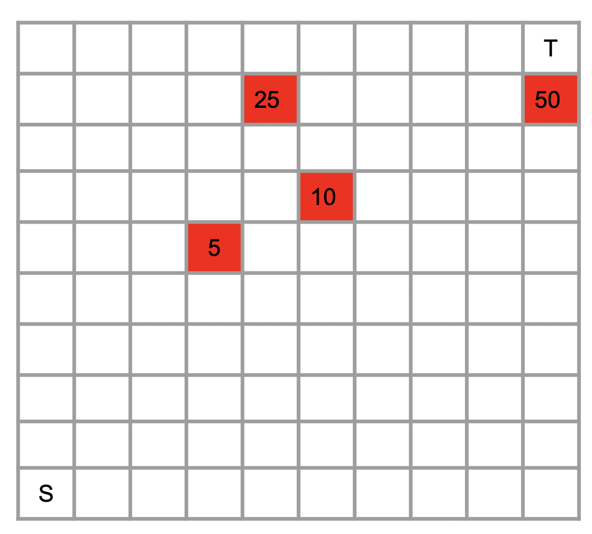
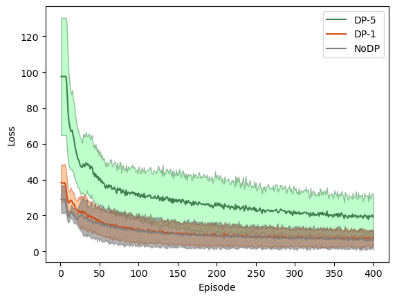

# Privacy-Preserving-Reinforcement-Learning-Beyond-Expectation
Privacy-Preserving Reinforcement Learning Beyond Expectation:

In this paper, we incorporated cumulative prospect theory (CPT) into the objective of a reinforcement learning (RL) problem to quantify risk and used differential privacy to keep decision making hidden from external parties.

<table>
  <tr>
    <td></td>
    <td>The 10 × 10 square region on which the PP-CPT- RL algorithm is evaluated. The agent needs to learn a policy to reach target T from start S. There are obstacles in the environment (red squares), and the agent incurs a different cost when encountering each obstacle</td>
  </tr>
 </table>
 
 <table>
  <tr>
    <td></td>
    <td>T Loss values averaged over 20 runs. Shaded regions indicate variance of the loss. When $\sigma = 1$ (red curve, denoted DP − 1), the average loss and its variance is comparable to the setting without differential privacy (blue curve, denoted NoDP). Choosing $\sigma = 5$  (green curve, denoted DP − 5) provides improved guarantees on privacy according to Theorem 1, but results in a higher loss, thus demonstrating a privacy-utility tradeoff.
 </td>
  </tr>
 </table>

```ruby
require 'matplotlib, gym, torch and PIL, cv2'
conda install matplotlib
conda install -c conda-forge pytorch-gpu
conda install -c conda-forge gym
conda install -c menpo opencv
```

To run the exprimetns:

```ruby

python CPT-TwoDimensionQLearning.py --DP  1 --CPT 1 --sigma 1

--DF 1 to turn on differential privacy otherwise 0
--CPT 1 to turn on risk-neutral otherwise 0
--sigma (float): the hyperparameter for differential privacy
```

To cite this paper:

```ruby

@article{rajabi2022privacy,
  title={Privacy-Preserving Reinforcement Learning Beyond Expectation},
  author={Rajabi, Arezoo and Ramasubramanian, Bhaskar and Maruf, Abdullah Al and Poovendran, Radha},
  journal={the 61st IEEE Conference on Decision and Control (CDC)},
  year={2022}
}
```


 
 


